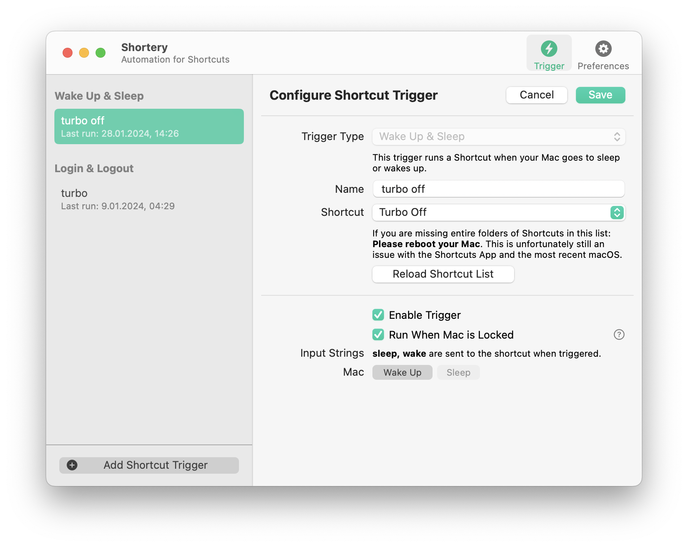
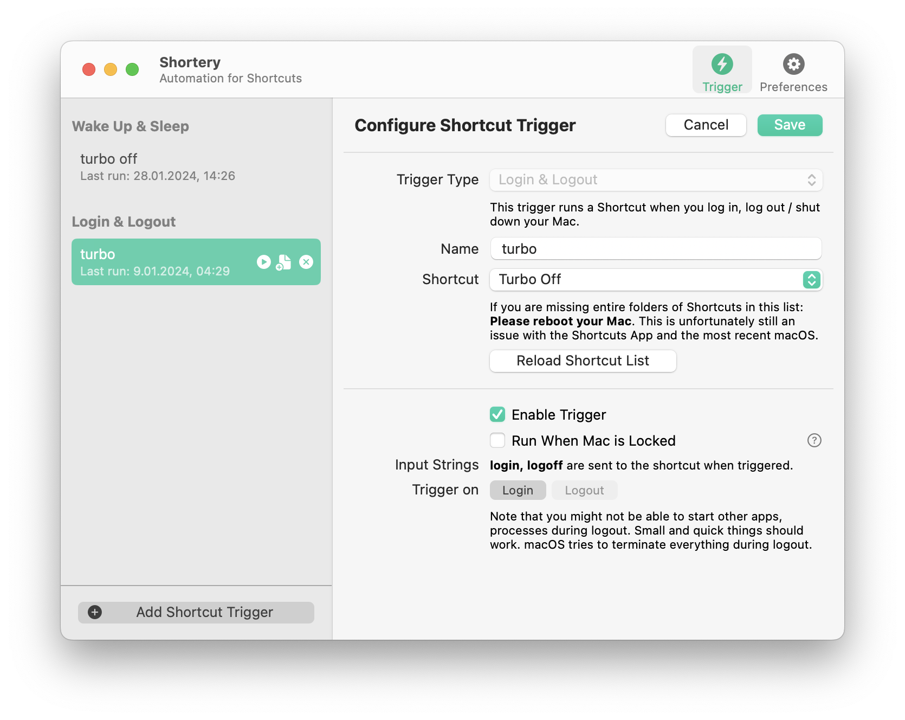

# turbo-boost-disable

I love TBS but was being constantly bombared with at least 3 login prompts every time I unlocked my computer.
# Install
## 1. Setup (Required)

Download the directory, open terminal and run `chmod +x load.sh` and `./load.sh` before placing the kext to somewhere safe from deletion
## 2. Shortcut Set-Up
*You need to enable Allow running scripts from shortcuts settings for these shortcuts to work*
1. Remember where you copied the kext (somewhere it doesn't bother you) now go there and option+right click to copy the pathname
2. Install both shortcuts. During setup paste the copied path to setup input area 

* Now you can run it manually. You can now choose automatic control or manual control to disable/enable Turbo Boost.
## 3. Automatic Control (suggested)
To ensure Turbo Boost is always disabled, we need to run `disable turbo boost` shortcut every time the computer is unlocked.
This is because after unlock the kext will stop working (for some reason).

You can choose to do this yourself manually, but good luck remembering to do that every time.

This can be easily automated on macOS.
- Download [Shortery](https://apps.apple.com/tr/app/shortery/id1594183810?mt=12) from Mac App Store
#### In the app
1. Set-up a new automation with trigger type wake up/sleep
2. Give it a name
3. Select the shortcut from list
3. And finally select wake up as the trigger

2. Do the same for login for making sure it runs

